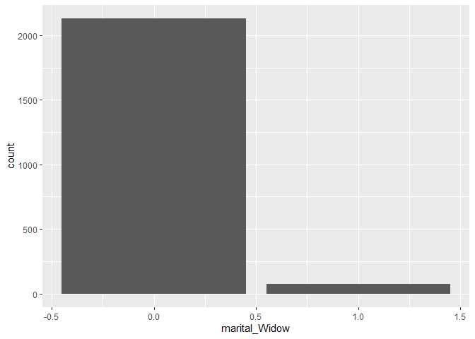

EDA
================
Cory Lowe
May 28, 2024

# IMPORT LIBRARIES

``` r
library(ggplot2)
library(dplyr)
```

    ## 
    ## Attaching package: 'dplyr'

    ## The following objects are masked from 'package:stats':
    ## 
    ##     filter, lag

    ## The following objects are masked from 'package:base':
    ## 
    ##     intersect, setdiff, setequal, union

``` r
library(magrittr)
```

# IMPORT DATA

``` r
df_customers <- read.csv("../02_data/ifood_df.csv")

df_customers <- df_customers %>%
  mutate(AcceptedCmp1 = factor(if_else(AcceptedCmp1 == 1, "True", "False"))) %>%
  mutate(AcceptedCmp2 = factor(if_else(AcceptedCmp2 == 1, "True", "False"))) %>%
  mutate(AcceptedCmp3 = factor(if_else(AcceptedCmp3 == 1, "True", "False"))) %>%
  mutate(AcceptedCmp4 = factor(if_else(AcceptedCmp4 == 1, "True", "False"))) %>%
  mutate(AcceptedCmp5 = factor(if_else(AcceptedCmp5 == 1, "True", "False"))) %>%
  mutate(Response = factor(if_else(Response == 1, "True", "False"))) %>%
  mutate(Complain = factor(if_else(Complain == 1, "True", "False"))) %>%
  mutate(education_2n.Cycle = factor(if_else(education_2n.Cycle == 1, "True", "False"))) %>%
  mutate(education_Basic = factor(if_else(education_Basic == 1, "True", "False"))) %>%
  mutate(education_Graduation = factor(if_else(education_Graduation == 1, "True", "False"))) %>%
  mutate(education_Master = factor(if_else(education_Master == 1, "True", "False"))) %>%
  mutate(education_PhD = factor(if_else(education_PhD == 1, "True", "False")))
```

# INITIAL LOOK AT DATA

``` r
summary(df_customers)
```

    ##      Income          Kidhome          Teenhome         Recency     
    ##  Min.   :  1730   Min.   :0.0000   Min.   :0.0000   Min.   : 0.00  
    ##  1st Qu.: 35196   1st Qu.:0.0000   1st Qu.:0.0000   1st Qu.:24.00  
    ##  Median : 51287   Median :0.0000   Median :0.0000   Median :49.00  
    ##  Mean   : 51622   Mean   :0.4422   Mean   :0.5066   Mean   :49.01  
    ##  3rd Qu.: 68281   3rd Qu.:1.0000   3rd Qu.:1.0000   3rd Qu.:74.00  
    ##  Max.   :113734   Max.   :2.0000   Max.   :2.0000   Max.   :99.00  
    ##     MntWines        MntFruits     MntMeatProducts  MntFishProducts 
    ##  Min.   :   0.0   Min.   :  0.0   Min.   :   0.0   Min.   :  0.00  
    ##  1st Qu.:  24.0   1st Qu.:  2.0   1st Qu.:  16.0   1st Qu.:  3.00  
    ##  Median : 178.0   Median :  8.0   Median :  68.0   Median : 12.00  
    ##  Mean   : 306.2   Mean   : 26.4   Mean   : 165.3   Mean   : 37.76  
    ##  3rd Qu.: 507.0   3rd Qu.: 33.0   3rd Qu.: 232.0   3rd Qu.: 50.00  
    ##  Max.   :1493.0   Max.   :199.0   Max.   :1725.0   Max.   :259.00  
    ##  MntSweetProducts  MntGoldProds    NumDealsPurchases NumWebPurchases 
    ##  Min.   :  0.00   Min.   :  0.00   Min.   : 0.000    Min.   : 0.000  
    ##  1st Qu.:  1.00   1st Qu.:  9.00   1st Qu.: 1.000    1st Qu.: 2.000  
    ##  Median :  8.00   Median : 25.00   Median : 2.000    Median : 4.000  
    ##  Mean   : 27.13   Mean   : 44.06   Mean   : 2.318    Mean   : 4.101  
    ##  3rd Qu.: 34.00   3rd Qu.: 56.00   3rd Qu.: 3.000    3rd Qu.: 6.000  
    ##  Max.   :262.00   Max.   :321.00   Max.   :15.000    Max.   :27.000  
    ##  NumCatalogPurchases NumStorePurchases NumWebVisitsMonth AcceptedCmp3
    ##  Min.   : 0.000      Min.   : 0.000    Min.   : 0.000    False:2042  
    ##  1st Qu.: 0.000      1st Qu.: 3.000    1st Qu.: 3.000    True : 163  
    ##  Median : 2.000      Median : 5.000    Median : 6.000                
    ##  Mean   : 2.645      Mean   : 5.824    Mean   : 5.337                
    ##  3rd Qu.: 4.000      3rd Qu.: 8.000    3rd Qu.: 7.000                
    ##  Max.   :28.000      Max.   :13.000    Max.   :20.000                
    ##  AcceptedCmp4 AcceptedCmp5 AcceptedCmp1 AcceptedCmp2  Complain    Z_CostContact
    ##  False:2041   False:2044   False:2063   False:2175   False:2185   Min.   :3    
    ##  True : 164   True : 161   True : 142   True :  30   True :  20   1st Qu.:3    
    ##                                                                   Median :3    
    ##                                                                   Mean   :3    
    ##                                                                   3rd Qu.:3    
    ##                                                                   Max.   :3    
    ##    Z_Revenue   Response         Age       Customer_Days  marital_Divorced
    ##  Min.   :11   False:1872   Min.   :24.0   Min.   :2159   Min.   :0.0000  
    ##  1st Qu.:11   True : 333   1st Qu.:43.0   1st Qu.:2339   1st Qu.:0.0000  
    ##  Median :11                Median :50.0   Median :2515   Median :0.0000  
    ##  Mean   :11                Mean   :51.1   Mean   :2513   Mean   :0.1043  
    ##  3rd Qu.:11                3rd Qu.:61.0   3rd Qu.:2688   3rd Qu.:0.0000  
    ##  Max.   :11                Max.   :80.0   Max.   :2858   Max.   :1.0000  
    ##  marital_Married  marital_Single   marital_Together marital_Widow    
    ##  Min.   :0.0000   Min.   :0.0000   Min.   :0.0000   Min.   :0.00000  
    ##  1st Qu.:0.0000   1st Qu.:0.0000   1st Qu.:0.0000   1st Qu.:0.00000  
    ##  Median :0.0000   Median :0.0000   Median :0.0000   Median :0.00000  
    ##  Mean   :0.3873   Mean   :0.2163   Mean   :0.2576   Mean   :0.03447  
    ##  3rd Qu.:1.0000   3rd Qu.:0.0000   3rd Qu.:1.0000   3rd Qu.:0.00000  
    ##  Max.   :1.0000   Max.   :1.0000   Max.   :1.0000   Max.   :1.00000  
    ##  education_2n.Cycle education_Basic education_Graduation education_Master
    ##  False:2007         False:2151      False:1092           False:1841      
    ##  True : 198         True :  54      True :1113           True : 364      
    ##                                                                          
    ##                                                                          
    ##                                                                          
    ##                                                                          
    ##  education_PhD    MntTotal      MntRegularProds  AcceptedCmpOverall
    ##  False:1729    Min.   :   4.0   Min.   :-283.0   Min.   :0.0000    
    ##  True : 476    1st Qu.:  56.0   1st Qu.:  42.0   1st Qu.:0.0000    
    ##                Median : 343.0   Median : 288.0   Median :0.0000    
    ##                Mean   : 562.8   Mean   : 518.7   Mean   :0.2993    
    ##                3rd Qu.: 964.0   3rd Qu.: 884.0   3rd Qu.:0.0000    
    ##                Max.   :2491.0   Max.   :2458.0   Max.   :4.0000

``` r
head(df_customers)
```

    ##   Income Kidhome Teenhome Recency MntWines MntFruits MntMeatProducts
    ## 1  58138       0        0      58      635        88             546
    ## 2  46344       1        1      38       11         1               6
    ## 3  71613       0        0      26      426        49             127
    ## 4  26646       1        0      26       11         4              20
    ## 5  58293       1        0      94      173        43             118
    ## 6  62513       0        1      16      520        42              98
    ##   MntFishProducts MntSweetProducts MntGoldProds NumDealsPurchases
    ## 1             172               88           88                 3
    ## 2               2                1            6                 2
    ## 3             111               21           42                 1
    ## 4              10                3            5                 2
    ## 5              46               27           15                 5
    ## 6               0               42           14                 2
    ##   NumWebPurchases NumCatalogPurchases NumStorePurchases NumWebVisitsMonth
    ## 1               8                  10                 4                 7
    ## 2               1                   1                 2                 5
    ## 3               8                   2                10                 4
    ## 4               2                   0                 4                 6
    ## 5               5                   3                 6                 5
    ## 6               6                   4                10                 6
    ##   AcceptedCmp3 AcceptedCmp4 AcceptedCmp5 AcceptedCmp1 AcceptedCmp2 Complain
    ## 1        False        False        False        False        False    False
    ## 2        False        False        False        False        False    False
    ## 3        False        False        False        False        False    False
    ## 4        False        False        False        False        False    False
    ## 5        False        False        False        False        False    False
    ## 6        False        False        False        False        False    False
    ##   Z_CostContact Z_Revenue Response Age Customer_Days marital_Divorced
    ## 1             3        11     True  63          2822                0
    ## 2             3        11    False  66          2272                0
    ## 3             3        11    False  55          2471                0
    ## 4             3        11    False  36          2298                0
    ## 5             3        11    False  39          2320                0
    ## 6             3        11    False  53          2452                0
    ##   marital_Married marital_Single marital_Together marital_Widow
    ## 1               0              1                0             0
    ## 2               0              1                0             0
    ## 3               0              0                1             0
    ## 4               0              0                1             0
    ## 5               1              0                0             0
    ## 6               0              0                1             0
    ##   education_2n.Cycle education_Basic education_Graduation education_Master
    ## 1              False           False                 True            False
    ## 2              False           False                 True            False
    ## 3              False           False                 True            False
    ## 4              False           False                 True            False
    ## 5              False           False                False            False
    ## 6              False           False                False             True
    ##   education_PhD MntTotal MntRegularProds AcceptedCmpOverall
    ## 1         False     1529            1441                  0
    ## 2         False       21              15                  0
    ## 3         False      734             692                  0
    ## 4         False       48              43                  0
    ## 5          True      407             392                  0
    ## 6         False      702             688                  0

# CAMPAIGN SUCCESS VARIABLE

``` r
df_customers %>%
  ggplot(aes(x = Response)) +
  geom_bar(aes(fill = Response))
```

<!-- -->

- “Response variables” much higher proportion than “AcceptedCmp”
  variables.

``` r
df_customers %>%
  ggplot(aes(x = AcceptedCmp1)) +
  geom_bar(aes(fill = AcceptedCmp1))
```

<!-- -->

``` r
df_customers %>%
  ggplot(aes(x = AcceptedCmp2)) +
  geom_bar(aes(fill = AcceptedCmp2))
```

<!-- -->

``` r
df_customers %>%
  ggplot(aes(x = AcceptedCmp3)) +
  geom_bar(aes(fill = AcceptedCmp3))
```

<!-- -->

``` r
df_customers %>%
  ggplot(aes(x = AcceptedCmp4)) +
  geom_bar(aes(fill = AcceptedCmp4))
```

<!-- -->

``` r
df_customers %>%
  ggplot(aes(x = AcceptedCmp5)) +
  geom_bar(aes(fill = AcceptedCmp5))
```

<!-- -->

# COMPLAIN

``` r
df_customers %>%
  ggplot(aes(x = Complain)) +
  geom_bar(aes(fill = Complain))
```

<!-- -->

# CUSTOMER DAYS

``` r
df_customers %>%
  ggplot(aes(x = Customer_Days)) +
  geom_bar()
```

<!-- -->

``` r
df_customers %>%
  ggplot(aes(x = Customer_Days)) +
  geom_histogram(bins = 70)
```

<!-- -->

- DtCustomer variable missing. This must be the replacement one.
- This looks pretty consistant, meaning the campaigns were launched
  consistently.

# EDUCATION

``` r
df_customers %>%
  ggplot(aes(x = education_2n.Cycle)) +
  geom_bar()
```

<!-- -->

``` r
df_customers %>%
  ggplot(aes(x = education_Basic)) +
  geom_bar()
```

<!-- -->

``` r
df_customers %>%
  ggplot(aes(x = education_Graduation)) +
  geom_bar()
```

<!-- -->

``` r
df_customers %>%
  ggplot(aes(x = education_Master)) +
  geom_bar()
```

<!-- -->

``` r
df_customers %>%
  ggplot(aes(x = education_PhD)) +
  geom_bar()
```

<!-- -->

``` r
tmp_education_cnt <- rowSums(df_customers[, c("education_2n.Cycle", "education_Basic", "education_Graduation", "education_Master", "education_PhD")])

print("All educations are coded zero (doesn't have), or 1 (does have).")
print("I need to confirm if each person has 1 and only one education level (i.e. mutually exclusive educations and no missed codings")
print(head(tmp_education_cnt))

print("Min =1 means everyone has at least 1 education")
min(tmp_education_cnt)

print("Max = 1 means everyone has at most 1 education")
max(tmp_education_cnt)

print("Therefore, we can deduce that everyone has one educational level.")

rm(tmp_education_cnt)
```

*This block doesn’t run, as the variables were turned into factors (at
the data import stage), so when plotting, the true false factors would
be on a discrete axis (vs a continuous 0 / 1 axis.)*

``` r
tmp_marital_cnt <- rowSums(df_customers[, c("marital_Divorced", "marital_Married", "marital_Single", "marital_Together", "marital_Widow")])

print("All marital are coded zero (doesn't have), or 1 (does have).")
print("I need to confirm if each person has 1 and only one marital level (i.e. mutually exclusive marital status and no missed codings")

min(tmp_marital_cnt)

max(tmp_marital_cnt)

rm(tmp_marital_cnt)
```

*This block doesn’t run, as the variables were turned into factors (at
the data import stage), so when plotting, the true false factors would
be on a discrete axis (vs a continuous 0 / 1 axis.)*

``` r
df_customers %>%
  ggplot(aes(x = marital_Divorced)) +
  geom_bar()
```

<!-- -->

``` r
df_customers %>%
  ggplot(aes(x = marital_Married)) +
  geom_bar()
```

<!-- -->

``` r
df_customers %>%
  ggplot(aes(x = marital_Single)) +
  geom_bar()
```

<!-- -->

``` r
df_customers %>%
  ggplot(aes(x = marital_Together)) +
  geom_bar()
```

<!-- -->

``` r
df_customers %>%
  ggplot(aes(x = marital_Widow)) +
  geom_bar()
```

<!-- -->
